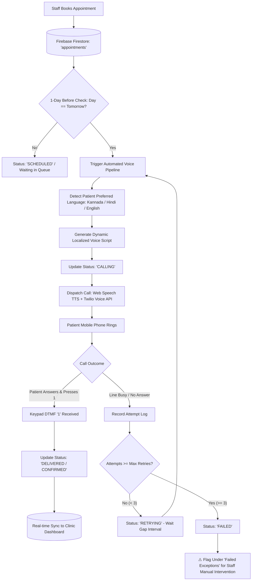

# HMIS — Complete System & CI/CD Pipeline Documentation

This document outlines the **two core pipelines** powering the **HMIS Digital Appointment & Automated Voice Reminder System**:
1. **The Automated 1-Day Before Voice Reminder & Telephony Pipeline**
2. **The CI/CD Build & Deployment Pipeline (GitHub Actions → Netlify)**

---

## 📞 Pipeline 1: Automated 1-Day Before Voice Reminder Pipeline

This pipeline automates the entire lifecycle of patient appointment reminders, eliminating manual phone calls and language barriers.



### Detailed Pipeline Stages:

| Stage | Trigger / Component | Action Performed | Resulting State |
|:---|:---|:---|:---|
| **1. Intake & Slot Booking** | `src/routes/index.tsx` | Staff enters patient details, phone number, slot time, and preferred language (e.g. Kannada). | Saved in Firestore collection `/appointments` with status `scheduled`. |
| **2. 1-Day Before Evaluator** | `src/lib/voice-reminder.ts` | Evaluates appointments where scheduled date equals tomorrow (`DAYS[1]`). | Identifies all eligible patients for tomorrow's reminder queue. |
| **3. Multilingual Voice Generation** | `VOICE_SCRIPTS` engine | Generates personalized script in Kannada, Hindi, or English containing patient name, clinic name, date, and treatment. | Audio payload created with BCP-47 language accent (`kn-IN`, `hi-IN`, `en-US`). |
| **4. Call Initiation** | `/api/make-call` | Serverless function sends Twilio API request or browser Web Speech API. | Status updates to `calling` with live visual ringing indicator. |
| **5. Confirmation & Keypad Input** | Twilio TwiML `<Gather>` | Patient hears message and presses `1` on mobile phone keypad. | Status updates to `delivered` (Confirmed). |
| **6. Automated Retry Handling** | `clinic-store.ts` retry loop | If line is busy or unanswered, increments attempt count and waits for retry interval. | Status transitions to `retrying`. |
| **7. Staff Escalation** | `reminders.index.tsx` | After 3 failed attempts, marks reminder as `failed`. | Red warning badge appears prompting clinic staff to call patient manually. |

---

## 🚀 Pipeline 2: CI/CD Build & Deployment Pipeline

This pipeline automatically tests, builds, and deploys any code changes pushed to GitHub directly to the live production server on Netlify.

```mermaid
flowchart LR
    A[Developer Git Push to 'main'] --> B[GitHub Actions Runner: ubuntu-latest]
    B --> C[Checkout Repository]
    C --> D[Setup Node.js v20 with npm cache]
    D --> E[npm ci: Install Dependencies]
    E --> F[npm run build: Vite + TanStack Start + Nitro]
    F --> G[Inject Firebase & Twilio Environment Secrets]
    G --> H[Generate Output: /dist + /.netlify/functions]
    H --> I[Deploy to Netlify Production CDN]
    I --> J[Live at lokapurdentalclinic.netlify.app]
```



### GitHub Actions Workflow Configuration (`.github/workflows/deploy.yml`):

```yaml
name: Deploy to Netlify

on:
  push:
    branches:
      - main
  pull_request:
    branches:
      - main

jobs:
  build-and-deploy:
    name: Build & Deploy
    runs-on: ubuntu-latest

    steps:
      # Step 1: Checkout Code
      - name: Checkout repository
        uses: actions/checkout@v4

      # Step 2: Setup Node.js Environment
      - name: Setup Node.js
        uses: actions/setup-node@v4
        with:
          node-version: "20"
          cache: "npm"

      # Step 3: Install Exact Production Dependencies
      - name: Install dependencies
        run: npm ci

      # Step 4: Build Full-Stack SSR & Client Bundles
      - name: Build
        run: npm run build
        env:
          NITRO_PRESET: netlify
          VITE_FIREBASE_API_KEY: ${{ secrets.VITE_FIREBASE_API_KEY }}
          VITE_FIREBASE_AUTH_DOMAIN: ${{ secrets.VITE_FIREBASE_AUTH_DOMAIN }}
          VITE_FIREBASE_PROJECT_ID: ${{ secrets.VITE_FIREBASE_PROJECT_ID }}
          VITE_FIREBASE_STORAGE_BUCKET: ${{ secrets.VITE_FIREBASE_STORAGE_BUCKET }}
          VITE_FIREBASE_MESSAGING_SENDER_ID: ${{ secrets.VITE_FIREBASE_MESSAGING_SENDER_ID }}
          VITE_FIREBASE_APP_ID: ${{ secrets.VITE_FIREBASE_APP_ID }}

      # Step 5: Deploy Artifacts to Netlify Production
      - name: Deploy to Netlify (Production)
        if: github.ref == 'refs/heads/main' && github.event_name == 'push'
        uses: nwtgck/actions-netlify@v3.0
        with:
          publish-dir: "./dist"
          production-deploy: true
          github-token: ${{ secrets.GITHUB_TOKEN }}
          deploy-message: "Deploy from GitHub Actions - ${{ github.sha }}"
        env:
          NETLIFY_AUTH_TOKEN: ${{ secrets.NETLIFY_AUTH_TOKEN }}
          NETLIFY_SITE_ID: ${{ secrets.NETLIFY_SITE_ID }}
```

---

## 📂 Downloadable Pipeline Files on Your Computer

| File Description | Location on Your Machine |
|:---|:---|
| **CI/CD Pipeline File** | `C:\Users\Rakshitha M\Downloads\HMIS_CI_CD_Pipeline.yml` |
| **CI/CD Pipeline (Desktop)** | `C:\Users\Rakshitha M\Desktop\HMIS_CI_CD_Pipeline.yml` |
| **Complete System Pipeline Doc** | `C:\Users\Rakshitha M\Downloads\HMIS_Complete_System_Pipeline.md` |
| **Complete System Pipeline (Desktop)** | `C:\Users\Rakshitha M\Desktop\HMIS_Complete_System_Pipeline.md` |
| **In Workspace Repo** | [deploy.yml](file:///e:/Desktop/hmis/.github/workflows/deploy.yml) and [PIPELINE.md](file:///e:/Desktop/hmis/PIPELINE.md) |
