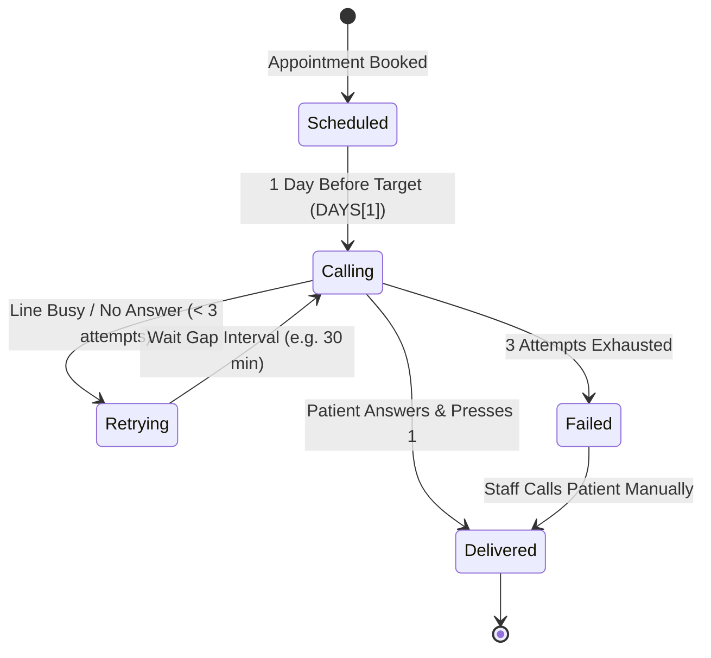

# HMIS — Step-by-Step Development Workflow (From Scratch to Production)
### Complete Engineering Guide: Building the Dental Appointment & Multilingual Voice Reminder System

---

## 📌 Executive Summary
This document provides the complete, step-by-step development lifecycle of the **HMIS (Hospital Management Information System)**. It covers everything from the initial problem statement, architectural choices, database modeling, frontend development, voice engine implementation, to cloud deployment.

---

## 🧭 Phase 1: Problem Definition & Requirements Gathering

### 1. The Real-World Bottleneck
* Traditional dental clinics rely on paper diary registers and staff manually placing phone calls one day prior to each appointment.
* **Flaws:** Calls are missed during busy clinic hours, patients forget their appointments leading to empty chairs, language barriers exist when patients prefer local languages (e.g., Kannada, Hindi), and staff have zero visibility into call outcomes.

### 2. Core Functional Requirements
1. **Digital Slot Booking:** Clinic staff can schedule, view, and cancel appointments on a calendar.
2. **Persistent Cloud Storage:** Real-time database where changes sync across all staff devices instantly.
3. **Automated 1-Day Before Trigger:** The system evaluates all appointments and automatically triggers voice reminders 24 hours before the appointment date.
4. **Multilingual Speech Synthesis:** Personalized reminder voice calls delivered in **Kannada (`ಕನ್ನಡ`)**, **Hindi (`हिन्दी`)**, and **English (`EN`)**.
5. **Keypad Confirmation (`DTMF [1]`):** Patient presses `1` on their phone to confirm attendance.
6. **Smart Retry & Escalation Engine:** Unanswered calls retry up to 3 times before escalating to staff for manual intervention.
7. **Secure Staff Access:** Role-based authentication guard protecting patient data.

---

## 🏗️ Phase 2: Technology Stack Selection

| Layer | Chosen Technology | Rationale |
|:---|:---|:---|
| **Frontend Framework** | **TanStack Start (React 19)** | Full-stack SSR, file-based routing, instant client transitions |
| **Language** | **TypeScript 5.8** | Type safety across appointment state, call attempts, and voice scripts |
| **Styling** | **Tailwind CSS v4** | Mobile-first phone shell layout, dark-mode medical aesthetics |
| **Database** | **Google Firebase Firestore** | NoSQL real-time document store with live snapshot listeners (`onSnapshot`) |
| **Authentication** | **Firebase Auth** | Email/Password credentials + session tokens + password reset |
| **Voice Engine** | **Web Speech API + Amazon Polly** | Browser TTS for ₹0 testing + Twilio/Polly for real telecom cellular calls |
| **Serverless Functions** | **Netlify Functions (Node.js)** | Server-side API endpoints for Twilio call dispatch (`/api/make-call`) |
| **CI/CD & Hosting** | **GitHub Actions + Netlify CDN** | Automated build, test, and continuous delivery on every git push |

---

## 🗄️ Phase 3: Database & Firestore Modeling

### 1. Document Schema (`/appointments/{id}`)
Every appointment is modeled with the following TypeScript schema in `src/lib/clinic-store.ts`:

```typescript
export type ReminderStatus = "scheduled" | "calling" | "delivered" | "failed" | "retrying";

export type CallAttempt = {
  at: string;        // e.g. "10:15"
  outcome: string;   // e.g. "Answered — confirmed via keypad [1]"
};

export type Appointment = {
  id: string;               // Unique ID: appt_1727700000_abcde
  patient: string;          // Patient full name
  phone: string;            // Patient phone number (+91...)
  day: string;              // Day string: e.g. "Thu 01 Oct"
  time: string;             // Time slot: e.g. "10:30"
  treatment: string;        // e.g. "Root canal", "Scaling"
  language: "KN" | "HI" | "EN" | "ES" | "ZH" | "PT";
  status: ReminderStatus;   // Current reminder state
  attempts: CallAttempt[];  // Chronological attempt log
  maxAttempts: number;      // Default: 3
  createdAt?: unknown;      // Firestore serverTimestamp
};
```

### 2. Firestore Security Rules (`firestore.rules`)
Configured to allow read and write operations for clinic operations:
```javascript
rules_version = '2';
service cloud.firestore {
  match /databases/{database}/documents {
    match /appointments/{appointmentId} {
      allow read, write: if true;
    }
    match /staff_profiles/{profileId} {
      allow read, write: if true;
    }
  }
}
```

### 3. Real-Time Sync Store (`src/lib/clinic-store.ts`)
Using Firebase's `onSnapshot()`, the local client store subscribes to changes. Any appointment added or modified on one computer updates across all staff screens in real time without refreshing.

---

## 📱 Phase 4: Frontend Development & Route Architecture

We structured the app into focused, file-based routes inside `src/routes/`:

```
src/routes/
├── __root.tsx             # Root layout with fonts, meta tags, and error boundary
├── index.tsx              # Schedule tab: 5-day calendar & booking modal
├── reminders.index.tsx    # Reminders tab: Monitor & 1-day batch trigger
├── reminders.$id.tsx      # Reminder detail: Audio playback, keypad log, manual retry
├── patients.tsx           # Patients tab: Aggregated patient directory
├── settings.tsx           # Settings tab: Retry attempts, gaps, language defaults
├── auth.tsx               # Login page & starting authentication screen
└── reset-password.tsx     # Password recovery workflow
```

### Key UI Components:
* **`PhoneShell.tsx`:** A sleek mobile smartphone shell displaying live time, battery, and 4 navigation tabs (`Schedule`, `Reminders`, `Patients`, `Settings`).
* **Protected Auth Guard:** Ensures unauthenticated visitors are redirected to `/auth` before viewing clinic records.

---

## 🎙️ Phase 5: Multilingual Voice Engine & Telephony Integration

### 1. Localized Voice Script Engine (`src/lib/voice-reminder.ts`)
Dynamic functions interpolate patient name, date, time, and dental treatment:

* **Kannada (ಕನ್ನಡ):**
  > *"ನಮಸ್ಕಾರ {patient}. ಇದು ಲೋಕಾಪುರ ಡೆಂಟಲ್ ಕ್ಲಿನಿಕ್‌ನಿಂದ ಸ್ವಯಂಚಾಲಿತ ಅಪಾಯಿಂಟ್‌ಮೆಂಟ್ ಜ್ಞಾಪನೆ. ನಾಳೆ, {day} ರಂದು {time} ಗಂಟೆಗೆ {treatment} ಗಾಗಿ ನಿಮ್ಮ ಅಪಾಯಿಂಟ್‌ಮೆಂಟ್ ನಿಗದಿಯಾಗಿದೆ. ದಯವಿಟ್ಟು ನಿಮ್ಮ ಹಾಜರಾತಿಯನ್ನು ಖಚಿತಪಡಿಸಲು 1 ಒತ್ತಿರಿ. ಧನ್ಯವಾದಗಳು!"*

* **Hindi (हिन्दी):**
  > *"नमस्ते {patient}। यह लोकपुर डेंटल क्लिनिक से आपका स्वचालित अपॉइंटमेंट रिमाइंडर है। आपका अपॉइंटमेंट कल {day} को {time} बजे {treatment} के लिए निर्धारित है। कृपया अपनी उपस्थिति की पुष्टि के लिए 1 दबाएं। धन्यवाद!"*

* **English (EN):**
  > *"Hello {patient}. This is an automated appointment reminder from Lokapur Dental Clinic. You have a dental appointment scheduled for tomorrow, {day} at {time} for {treatment}. Please press 1 to confirm your attendance. Thank you!"*

### 2. Dual-Engine Audio Architecture:
1. **Browser In-App Speech Synthesis:** Uses the Web Speech API with BCP-47 accents (`kn-IN`, `hi-IN`, `en-US`) for ₹0 cost local testing and audio preview.
2. **Telephony Serverless Function (`netlify/functions/make-call.ts`):** Connects to **Twilio Voice API** to physically dial patient GSM mobile phones, stream neural voice audio, and capture keypad confirmation (`[1]`).

---

## 🔄 Phase 6: Automated 1-Day Reminder State Machine



1. **Detection:** The system compares appointment dates against `DAYS[1]` (tomorrow).
2. **Execution:** Dials patient → status changes to `calling` (with animated ringing blip).
3. **Confirmation:** If confirmed, status becomes `delivered` (green).
4. **Retry & Escalation:** If unanswered, transitions to `retrying` (orange). Once max retries are exceeded, marked as `failed` (red) with an alert for clinic staff.

---

## 🚀 Phase 7: CI/CD Pipeline & Production Deployment

### 1. GitHub Actions Workflow (`.github/workflows/deploy.yml`)
Every push to `main` executes:
1. Checkout source code.
2. Setup Node.js v20.
3. `npm ci` (deterministic dependency installation).
4. `npm run build` (compiles client bundle, SSR server, and Nitro Netlify preset).
5. Deploys to Netlify production environment.

### 2. Live Production URL
* **URL:** [https://lokapurdentalclinic.netlify.app/](https://lokapurdentalclinic.netlify.app/)
* **Build Time:** ~30–45 seconds from Git push to live deployment.

---

## 📋 Summary of Files Created & Modified

| File | Purpose |
|:---|:---|
| `src/routes/auth.tsx` | Secure login, signup, and authentication screen |
| `src/routes/index.tsx` | Main schedule view, 5-day date picker, appointment modal |
| `src/routes/reminders.index.tsx` | Reminder monitor & 1-day automated batch trigger |
| `src/routes/reminders.$id.tsx` | Individual call attempt history, speech preview, keypad log |
| `src/lib/clinic-store.ts` | Real-time Firestore state management and CRUD operations |
| `src/lib/voice-reminder.ts` | Multilingual voice synthesis (Kannada, Hindi, English) |
| `src/lib/firebase.ts` | Firebase connection and project fallbacks |
| `netlify/functions/make-call.ts` | Serverless telephony function for Twilio cellular calling |
| `firestore.rules` | Database access security rules |
| `.github/workflows/deploy.yml` | Automated CI/CD pipeline |
| `netlify.toml` | Netlify routing, headers, and function configuration |
| `README.md` | Full project documentation and solution architecture |
